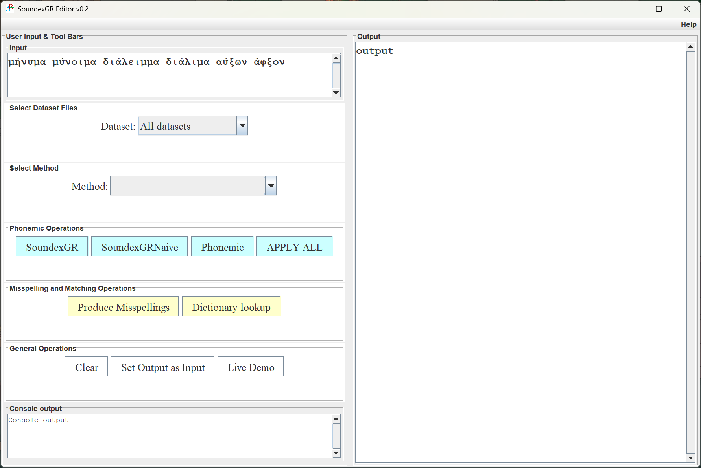
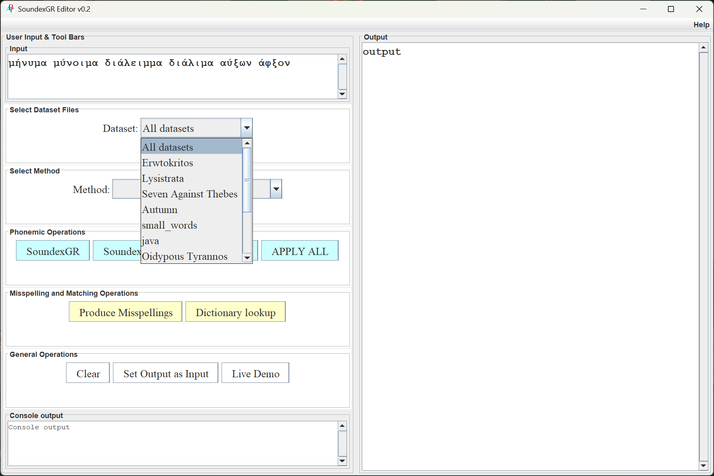
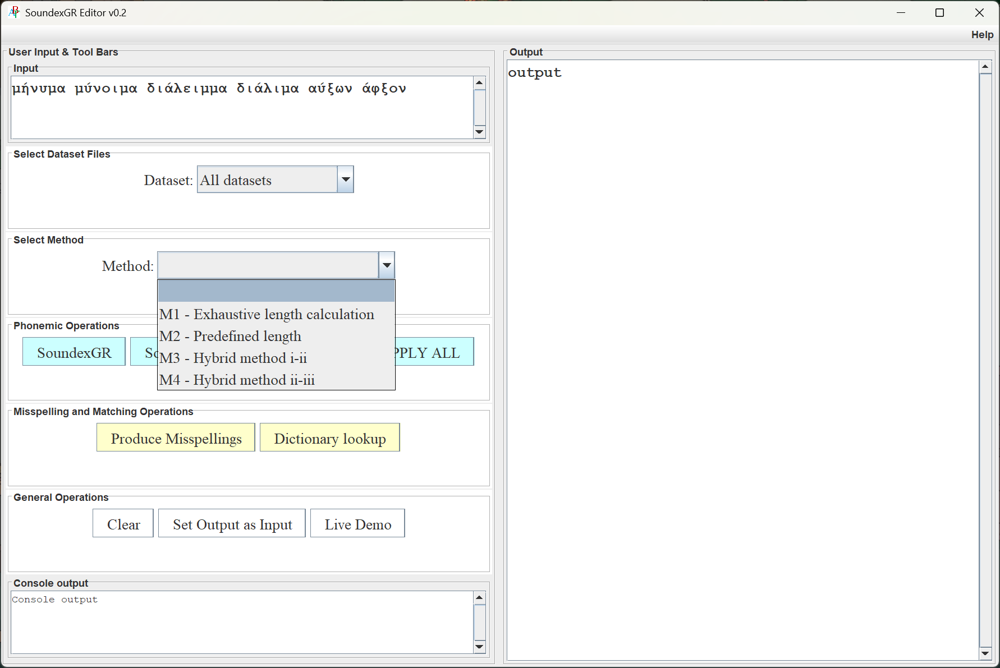
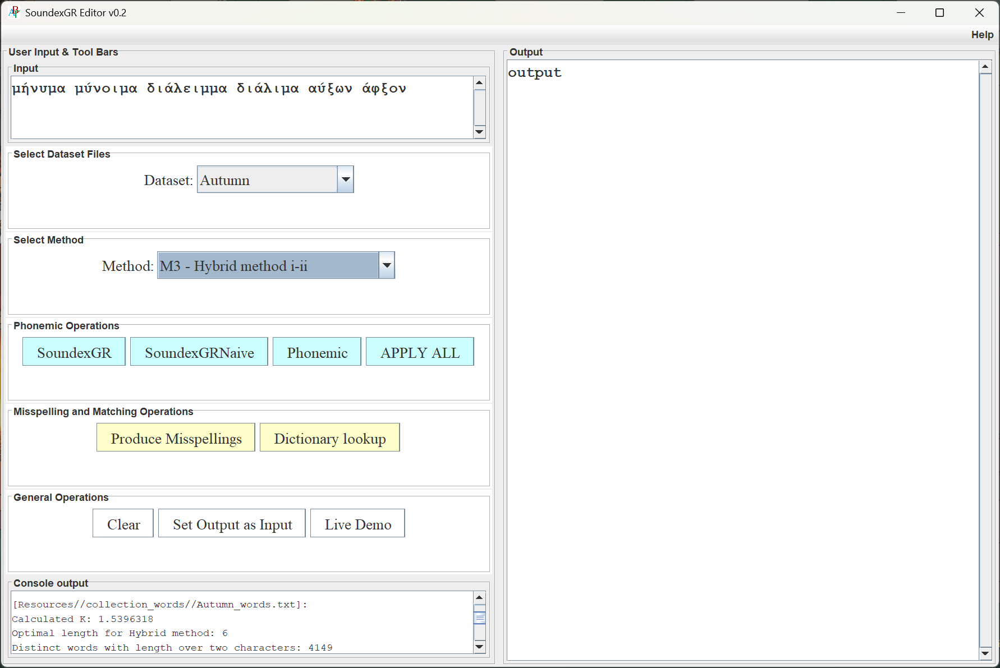
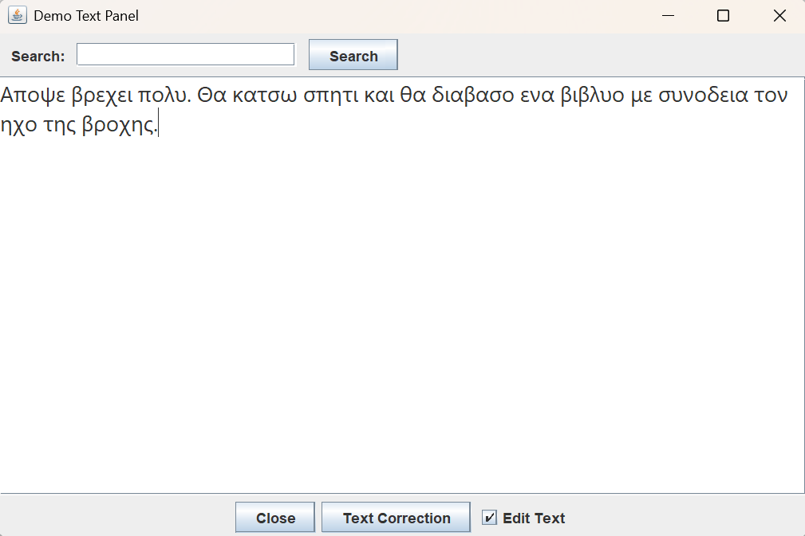
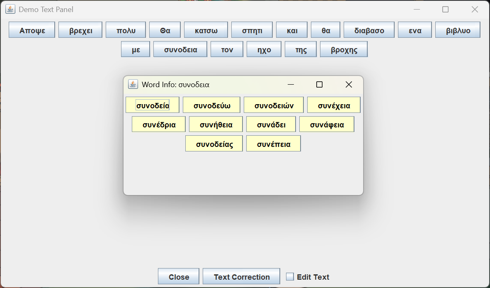
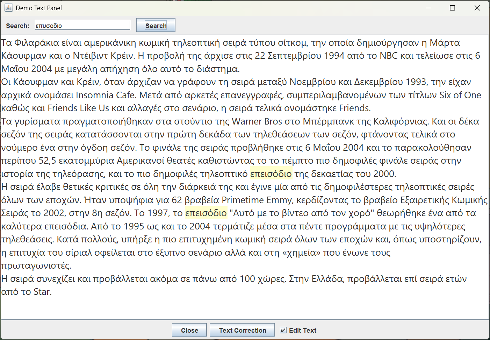

# SoundexGR Optimal Length Selection
On Finding the Optimal SoundexGR Code Length for Tackling the Out-of-Vocabulary Problem

This project builds upon the [SoundexGR algorithm](https://github.com/YannisTzitzikas/SoundexGR) proposed by Kavros and Tzitzikas (2023) for Greek phonetic matching. While SoundexGR achieves high accuracy, its performance depends on the chosen code length. Our work extends this by automatically selecting the optimal code length for a given dataset or task.

This repository contains the implementation and experimental evaluation of methods for automatically selecting the optimal SoundexGR code length for Greek phonetic matching.

## Methods Overview

### M1 – Exhaustive Search

* Tests a wide range of code lengths
* Selects the length with the highest average F-score
* Achieves highest accuracy but it is very expensive computationally

### M2 – Distinct-Words Based Heuristic

* Selects length based only on the number of distinct words
* Uses empirically derived intervals
* It is extremely fast but may deviate from optimal length

### M3 – Range-Based Optimization

* Tests lengths within a range [3,12]
* Chooses the length whose average collision list size is closest to a target value `K`
* Supports:

  * dynamic `K`
  * fixed `K` (e.g. `K = 1.5`)
* It is fast and stable but achieves lower accuracy

### M4 – Hybrid (M2 and M3)

* Uses M2 to get an initial estimate
* Refines locally using M3-style optimization
* Best trade-off between accuracy and speed

## Evaluation

The methods were evaluated on 10 Greek datasets of varying size and genre:

* Technical texts
* Biographies
* Poems
* Theatrical plays
* Proses

Dataset sizes range from 80 to 9,000+ distinct words.

## Interface

### Home screen


### Dataset Drop-Down Menu


### Method Drop-Down Menu


### Result


## Live Demo
We have developed a tool for showcasing various possible functionalities, in particular for word correction and for
search. As regards the first (word correction), The user can type/copy text, and then the tool enables the user to
correct the wrongly spelled words. The corrections are computed based on the phonemic codes and based on the
optimal length. This can be done for the entire text for the selected word, one screenshot is shown in Figure
6a. As regards the second (search), the tool (see screenshot in Figure 7) allows the user search for words within
the text they have entered in the text area. When the user enters a term into the search text slot and clicks the
"Search" button, the matches, through SoundexGR with optimal code length, are highlighted.

### Edit Text mode


### Interactive mode


### Search word in text


## Applicability

The proposed methods can be directly applied to:

* Document search (PDF/text viewers)
* Spell correction
* Autocompletion
* Entity Recognition
* Question Answering
* Structured data integration
* Phonetic user interfaces

## Running the Program

### To build and run the application, execute:

Using Git Bash
```
./run.sh
```

Using Command Prompt
```
.\run.cmd
```

## Author

**Yannis Tzitzikas**
Institute of Computer Science, FORTH, Heraklion, Crete, Greece

**Fotis Pelantakis**
Computer Science Department, University of Crete
